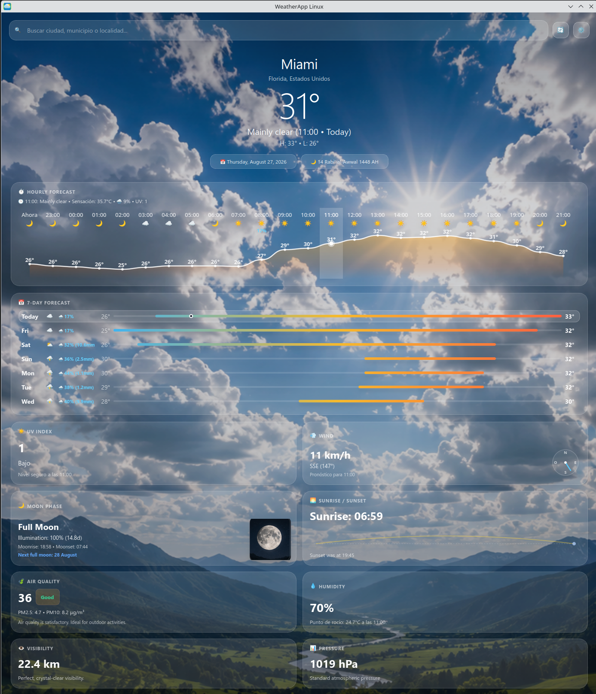
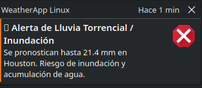
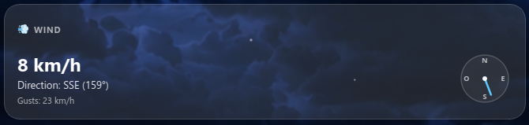
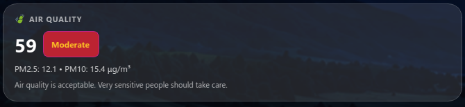
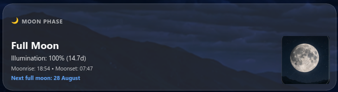
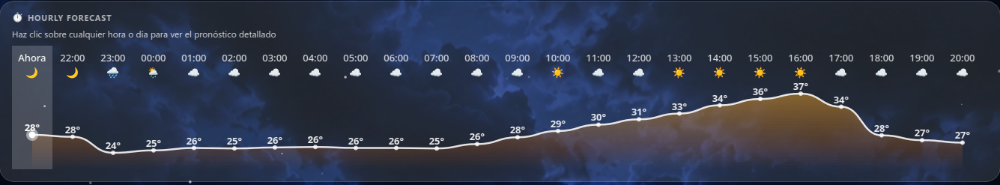
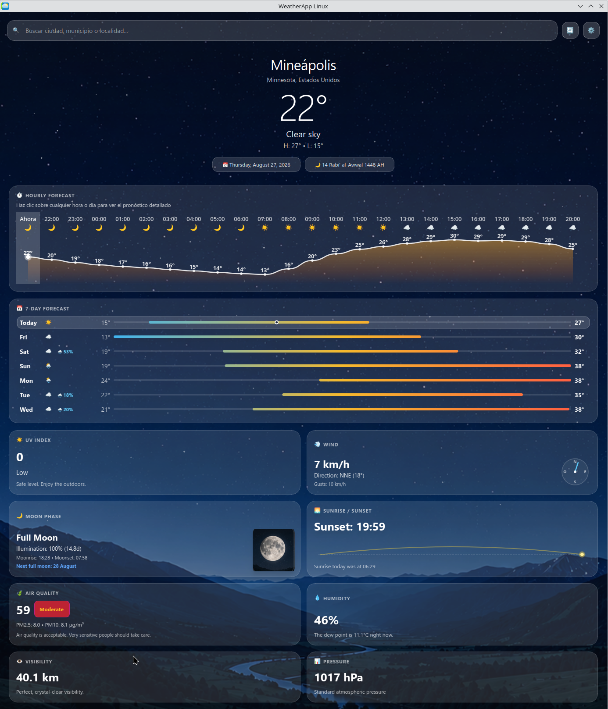

<div align="center">

# 🌤️ Caelum

### _A Fluid, Fast, and Visually Immersive Weather & Astronomical Experience for Linux_

[](https://python.org)
[](https://www.qt.io/)
[](https://wayland.freedesktop.org/)
[](LICENSE)
[](tests/)
[](https://open-meteo.com/)
[](assets/locales/)
[](src/utils/calendarios_mundo.py)

<br/>



_Caelum displaying real-time daytime conditions, 24h temperature curve, 7-day forecast bars, and the full 8-metric Bento Grid._

</div>

---

## 🌟 Highlights & Features

### 🎨 Fluid & Modern Glassmorphism Aesthetic

- **Dynamic Sky Palettes**: Background gradients seamlessly shift between golden hour, clear skies, overcast storm clouds, twilight, and starry nights according to exact solar elevation.
- **Hardware-Accelerated Particle Engine**: Smooth falling rain, snowfall, and twinkling stars composited directly by your GPU.
- **Crisp HiDPI & Fractional Scaling**: Optimized with `PassThrough` rounding policies for crystal-clear typography and cards on 1080p, 2K, and 4K displays.

### 🛡️ Real-Time Disaster Prevention & Severe Weather Alerts

- **Proactive Early Warning Engine**: Monitors sudden precipitation bursts ($\ge 30\text{ mm}$), flash flood risks, severe gale-force gusts, extreme heatwaves ($> 40^\circ\text{C}$), and hazardous UV levels.
- **Non-Intrusive Desktop Notifications**: Runs quietly in the background from your system tray and sends native Linux desktop alerts during critical weather changes.

<div align="center">
  
  <p><em>Proactive Flood Warning toast triggered during extreme rainfall events.</em></p>
</div>

### 📊 8-Card Bento Information Grid

- **💨 Wind Compass Widget**: Real-time speed, direction bearing, cardinal direction (e.g. `SSE (159°)`), and peak wind gusts.
- **🍃 Air Quality Index (AQI)**: Live European Air Quality Index with color-coded badges, health advisories, and PM2.5 / PM10 particulate concentrations.
- **🌔 Moon Phase & Astronomy**: Astronomical phase calculation, exact illumination percentage, moonrise/moonset timestamps, and next full moon countdown.
- **☀️ UV Index & Sun Trajectory**: Real-time UV risk category with solar countdown (_e.g., "Sunset in 3h 12m"_).
- **💧 Humidity & Dew Point**: Precise hygrometer with comfort index and Magnus-Tetens dew point calculation.
- **👁️ Visibility & Atmospheric Pressure**: Kilometre visibility clarity and hectopascal (hPa) barometric readings.

<div align="center">
  
  
  
  <p><em>Real-time Wind Compass, European AQI Card, and Astronomical Moon Tracker.</em></p>
</div>

### 📈 Interactive 24-Hour & 7-Day Forecasts

- **Dynamic 24h Temperature Curve**: Smooth cubic Bezier spline with hourly weather icons, day/night indicators, and rain probability. Click on any hour to inspect its metrics in detail.
- **Thermal 7-Day Spectrum Bars**: Visual horizontal temperature bars mapped from cold blues to warm ambers, displaying exact rain probabilities and cumulative millimetres.

<div align="center">
  
  <p><em>Interactive 24-hour cubic Bezier temperature curve.</em></p>
</div>

### 🌙 Night Mode & Dynamic Themes

- Automatic night-time transitions with stellar backdrops and moonlit landscapes.

<div align="center">
  
  <p><em>Clear night sky view with starry backdrop in Minneapolis.</em></p>
</div>

### 🌍 Multi-Language & 8 World Calendars Support

- **6 Built-in Languages**: English (`en`), Spanish (`es`), French (`fr`), Italian (`it`), German (`de`), and Japanese (`ja`).
- **Automatic System Locale Detection**: Adapts immediately to your operating system language (`auto`).
- **8 Configurable World Calendars**: Customize visible date pills from Settings (⚙️):
  - 📅 **Gregorian** (Universal / Western)
  - 🌙 **Hijri** (Islamic Lunar)
  - 🕎 **Hebrew** (Jewish Lunisolar)
  - ☀️ **Solar Persian / Jalali** (Iran & Central Asia)
  - ☸️ **Buddhist Era** (BE - Thailand & Southeast Asia)
  - 🇪🇹 **Coptic / Ethiopian** (Ge'ez 13 Months)
  - 🇮🇳 **Indian National** (Saka Samvat)
  - 🐉 **Chinese Traditional Lunisolar** (Nónglì / 12 Zodiac Animals)

### 🐧 Native Wayland & Desktop Integration

- **Display Server Compatibility**: Native **Wayland** protocol support (`xdg_activation`, zero-tearing) and **X11 (XCB)** fallback.
- **Single-Instance IPC**: Prevents duplicate windows; launching the app while already running smoothly brings the existing window to the foreground.
- **System Tray Management**: Live temperature badge on your taskbar with minimize-to-tray and quick action menu.
- **Instant Search with Caching**: 0 ms response search overlay with Open-Meteo & Nominatim geocoding and recent city history.

---

## 🚀 Getting Started

### Prerequisites

- **Linux Distribution**: Ubuntu, Fedora, Debian, Arch Linux, Manjaro, openSUSE, Pop!\_OS, etc.
- **Python**: Version `3.11+` with `python3-venv` installed.
- **Internet Connection**: Live weather data is fetched without requiring any private API keys.

---

### Quick Launch (1 Command)

```bash
git clone https://github.com/tu-usuario/caelum.git
cd "caelum"
./run.sh
```

> **Note**: `run.sh` automatically creates an isolated virtual environment (`venv/`), installs required PySide6 dependencies, and launches the application.

---

### Desktop Launcher Installation

To add Caelum to your application launcher menu and system dock:

```bash
./install_desktop.sh
```

This dynamically generates `caelum.desktop` pointing to your local path and registers it in `~/.local/share/applications/`.

---

## ⚙️ Configuration & Local Data

Caelum stores user preferences and cache according to the **XDG Base Directory Specification**:

| Directory / File                      | Description                                                                                        |
| ------------------------------------- | -------------------------------------------------------------------------------------------------- |
| `~/.config/weather_linux/config.json` | Persistent user preferences (language, temperature unit, wind unit, recent cities, tray settings). |
| `~/.cache/weather_linux/`             | In-memory & disk weather cache (15-minute TTL) and structured diagnostic logs (`weatherapp.log`).  |

---

## 🧪 Testing & Code Quality

The project includes an extensive deterministic test suite covering unit conversions, models, mock services, i18n locales, bento metrics, 8 world calendars, and display environment detectors:

```bash
# Run all 67 tests headlessly
QT_QPA_PLATFORM=offscreen venv/bin/python3 -m unittest discover -s tests -v
```

```text
Ran 67 tests in 14.520s
OK (skipped=3)
```

---

## 🏗️ Project Architecture

```text
├── config.py                 # Core application configuration, locales, and unit registries
├── main.py                   # Application entry point with Wayland HiDPI & IPC setup
├── run.sh                    # Automated self-bootstrapping launch script
├── install_desktop.sh        # XDG .desktop application installer
├── assets/
│   ├── fonts/                # Inter & modern system font assets
│   ├── icons/                # Weather vector icons & SVG assets
│   ├── images/               # High-resolution dynamic sky backgrounds
│   ├── locales/              # Translation catalogs (en, es, fr, it, de, ja)
│   └── styles/               # Glassmorphism QSS stylesheet definitions
├── src/
│   ├── componentes/          # Modular UI widgets (Bento cards, Search overlay, Tray, Alert banner)
│   ├── modelos/              # Domain dataclasses (WeatherReport, Location, Conditions, Units)
│   ├── servicios/            # Open-Meteo, Air Quality, Geocoding, I18n, and Worker threads
│   ├── utils/                # Environment detector, Astronomy math, Date helpers, IPC Manager
│   └── vistas/               # Main application window and Settings dialog
└── tests/                    # Unit testing suite (56 test cases)
```

---

## 📄 License

This project is licensed under the **GNU General Public License v3.0 (GPL-3.0)**. See the [LICENSE](LICENSE) file for details.

---

## 💡 Acknowledgements & Data Sources

- Weather forecasts and historical models powered by [Open-Meteo](https://open-meteo.com/).
- Air Quality Index data provided by Open-Meteo Air Quality API.
- Geocoding and location search powered by Open-Meteo Geocoding & OpenStreetMap [Nominatim](https://nominatim.openstreetmap.org/).
- Built with Python and [PySide6 / Qt for Python](https://wiki.qt.io/Qt_for_Python).
