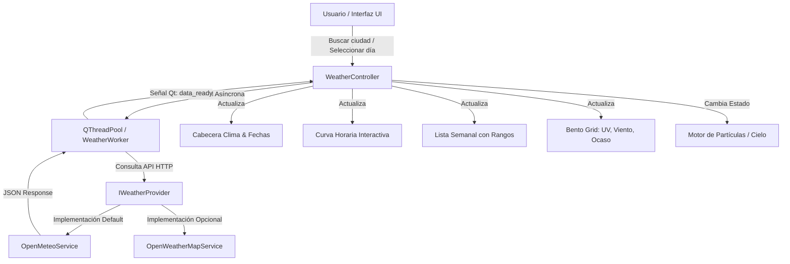

# 🌤️ WeatherApp Linux - Especificación Técnica & Arquitectura "Estilo Apple"

> **Aplicación de clima de escritorio para Linux con estética moderna tipo macOS/iOS Weather, animaciones fluidas a 60 FPS, diseño Glassmorphism Bento Grid y motor de datos ultraligero.**

---

## 📋 Índice
1. [Visión General y Principios de Diseño](#1-visión-general-y-principios-de-diseño)
2. [Decisiones Técnicas y Comparativa de Arquitectura](#2-decisiones-técnicas-y-comparativa-de-arquitectura)
3. [Arquitectura del Sistema y Flujo de Datos](#3-arquitectura-del-sistema-y-flujo-de-datos)
4. [Diseño de Interfaz: Bento Grid "Estilo Apple"](#4-diseño-de-interfaz-bento-grid-estilo-apple)
5. [Estructura del Proyecto](#5-estructura-del-proyecto)
6. [Requisitos y Dependencias](#6-requisitos-y-dependencias)
7. [Módulos Principales e Implementación de Referencia](#7-módulos-principales-e-implementación-de-referencia)
   - [7.1. Proveedor de Clima (Open-Meteo & OpenWeatherMap)](#71-proveedor-de-clima-open-meteo--openweathermap)
   - [7.2. Manejo Asíncrono de Red (QThreadPool & Signals)](#72-manejo-asíncrono-de-red-qthreadpool--signals)
   - [7.3. Curva Horaria Interactiva (QPainter Bézier / QtCharts)](#73-curva-horaria-interactiva-qpainter-bézier--qtcharts)
   - [7.4. Fondo de Partículas y Clima Dinámico](#74-fondo-de-partículas-y-clima-dinámico)
   - [7.5. Tarjetas Glassmorphism y Mapeo de Iconos SVG](#75-tarjetas-glassmorphism-y-mapeo-de-iconos-svg)
8. [Guía de Estilos y Paleta de Colores](#8-guía-de-estilos-y-paleta-de-colores)
9. [Plan de Desarrollo por Sprints](#9-plan-de-desarrollo-por-sprints)
10. [Integración Nativa con Linux](#10-integración-nativa-con-linux)

---

## 1. 🎯 Visión General y Principios de Diseño

WeatherApp Linux busca recrear la experiencia visual y fluidez de la app de Clima de Apple en el escritorio de Linux (GNOME, KDE Plasma, XFCE, Sway, Hyprland).

### Principios Fundamentales:
- 🚀 **Rendimiento Nativo y Cero Bloqueos**: Consumo inferior a **50 MB de RAM**, tasa de refresco a 60 FPS y procesamiento asíncrono en segundo plano (la UI nunca se congela).
- 🪟 **Estética Glassmorphism (Efecto Vidrio)**: Tarjetas translúcidas con bordes sutiles, desenfoque de fondo y sombras suaves.
- 🌦️ **Cielos Dinámicos y Partículas Ligeras**: Fondos con gradientes que cambian según la hora solar (amanecer, día, atardecer, noche) y partículas nativas optimizadas para lluvia, nieve, niebla o sol radiante.
- 📊 **Datos Hora a Hora Reales y Bento Grid**: Pronóstico interactivo continuo, rango térmico semanal y tarjetas modulares con métricas completas (Índice UV, Viento, Calidad del Aire, Humedad, Ocaso/Amanecer).
- 🌍 **Out-of-the-Box (Sin registros obligatorios)**: Datos meteorológicos listos para usar de inmediato a través de Open-Meteo (sin necesidad de crear API Keys), con opción de usar OpenWeatherMap.

---

## 2. 🛠️ Decisiones Técnicas y Comparativa de Arquitectura

| Componente | Elección Original | Elección Optimizada | Justificación Técnica |
| :--- | :--- | :--- | :--- |
| **Framework UI** | PySide6 (QWidgets) | **PySide6 (Qt6)** | Soporte oficial Qt, bindings actualizados, aceleración gráfica por hardware. |
| **Fondos Animados** | `QWebEngineView` (HTML/JS) | **`QPainter` / Shaders Nativos** | **Ahorro de ~250MB de RAM**. Elimina la necesidad de Chromium incrustado y soluciona incompatibilidades de transparencia en Wayland/X11. |
| **Gráficos Horarios** | `Plotnine` + `Matplotlib` (PNG) | **`PySide6.QtCharts` / `QPainter` Bézier** | **Render en 0 ms**. Permite curvas suaves con degradado, animaciones y tooltips interactivos al pasar el ratón. Elimina dependencias pesadas (`pandas`, `matplotlib`, `scipy`). |
| **Fuente de Datos** | OpenWeatherMap 2.5 (3 horas) | **Open-Meteo (1 hora nativo)** + Multi-proveedor | **Gratuito, sin API Key, pronóstico real hora a hora por 7 días**, geocodificación de ciudades y calidad del aire incluida. |
| **Iconografía** | CDN HTTP en tiempo real | **Iconos SVG Locales (Meteocons)** | Cero latencia, funcionamiento 100% offline, renderizado nítido con `QSvgRenderer`. |
| **Concurrencia** | `requests.get` en hilo UI | **`QThreadPool` + `QRunnable`** | Descarga asíncrona no bloqueante con manejo de estados de carga (*loading skeletons*). |
| **Calendarios** | Gregoriano + Hijri | **Dual (Gregoriano + Hijri)** | Soporte enriquecido de fechas con `hijri-converter`. |

---

## 3. 🏗️ Arquitectura del Sistema y Flujo de Datos

El proyecto implementa una arquitectura modular **MVC / Service-Provider**:



### Ciclo de Vida del Flujo de Datos:
1. **Inicio de la aplicación**: Lee la configuración local (última ciudad o auto-geolocalización por IP).
2. **Lanzamiento del Worker**: Se crea una tarea `QRunnable` que se ejecuta en el grupo de hilos global (`QThreadPool`).
3. **Parseo y Normalización**: El proveedor convierte el JSON crudo en un modelo de datos unificado (`WeatherDataModel`).
4. **Caché Local**: Se almacena la respuesta con un TTL de 15 minutos en memoria/disco para evitar peticiones repetidas.
5. **Emisión de Señales**: La interfaz recibe los datos y actualiza concurrentemente las tarjetas, la curva horaria y el color del cielo con transiciones suaves.

---

## 4. 🎨 Diseño de Interfaz: Bento Grid "Estilo Apple"

La interfaz se estructura en una cuadrícula armónica tipo *Bento Grid*:

```text
┌─────────────────────────────────────────────────────────────────────────┐
│  🔍 [ Buscar ciudad...                    ]  📍 Bogotá, CO  |  🕒 18:30 │
├─────────────────────────────────────────────────────────────────────────┤
│                                                                         │
│                         🌤️  Bogotá, Colombia                            │
│                              19°C                                       │
│                    Parcialmente Nublado                                 │
│                   Máx: 21°  •  Mín: 9°                                  │
│         📅 25 de Agosto de 2026  •  🌙 12 Safar 1448 AH                 │
│                                                                         │
├─────────────────────────────────────────────────────────────────────────┤
│ ⏱️ PRONÓSTICO 24 HORAS                                                  │
│ ┌─────────────────────────────────────────────────────────────────────┐ │
│ │  Ahora   19:00   20:00   21:00   22:00   23:00   00:00   01:00      │ │
│ │   ⛅      ⛅      🌧️      🌧️      ☁️      ☁️      🌙      🌙        │ │
│ │   19°     18°     16°     15°     14°     13°     12°     11°       │ │
│ │   ───•─────•───────•───────•───────•───────•───────•───────•───     │ │
│ │         (Curva Bézier interactiva con degradado de área)            │ │
│ └─────────────────────────────────────────────────────────────────────┘ │
├───────────────────────────────────┬─────────────────────────────────────┤
│ 📅 PRONÓSTICO 7 DÍAS              │ 🧩 MÉTRICAS CLIMÁTICAS (BENTO GRID) │
│ ┌───────────────────────────────┐ │ ┌─────────────────┬───────────────┐ │
│ │ Hoy    🌧️  10° ────█─── 21°   │ │ │ ☀️ ÍNDICE UV    │ 💨 VIENTO     │ │
│ │ Mar    ⛅  11° ──█───── 20°   │ │ │    3 Moderado   │   14 km/h NO  │ │
│ │ Mié    ☀️   9° ─────█── 22°   │ │ ├─────────────────┼───────────────┤ │
│ │ Jue    🌧️  12° ───█──── 19°   │ │ │ 🌅 OCASO        │ 💧 HUMEDAD    │ │
│ │ Vie    ⛅  10° ────█─── 21°   │ │ │   18:14 (Hoy)   │     78%       │ │
│ │ Sáb    ☀️   8° ──────█─ 23°   │ │ ├─────────────────┼───────────────┤ │
│ │ Dom    ☁️  11° ──█───── 18°   │ │ │ 🌡️ SENSACIÓN    │ 👁️ VISIBILIDAD │ │
│ └───────────────────────────────┘ │ │    19°C         │    10.0 km    │ │
│                                   │ └─────────────────┴───────────────┘ │
└───────────────────────────────────┴─────────────────────────────────────┘
```

---

## 5. 📁 Estructura del Proyecto

```text
weather_linux/
├── README.md                          # Guía de instalación y uso rápido
├── requirements.txt                   # Dependencias de Python mínimas
├── main.py                            # Punto de entrada de la aplicación
├── config.py                          # Configuración y constantes globales
│
├── assets/
│   ├── fonts/                         # Tipografías (SF Pro / Inter)
│   ├── icons/
│   │   ├── meteocons/                 # Iconos SVG meteorológicos locales
│   │   └── app_icon.svg               # Icono de la aplicación
│   └── styles/
│       ├── glassmorphism.qss          # Estilos Qt / CSS de tarjetas de vidrio
│       └── themes.json                # Definición de colores según el clima
│
├── src/
│   ├── __init__.py
│   │
│   ├── modelos/
│   │   ├── __init__.py
│   │   └── clima_datos.py             # Dataclasses tipadas (Current, Hourly, Daily)
│   │
│   ├── servicios/
│   │   ├── __init__.py
│   │   ├── base_provider.py           # Interfaz abstracta IWeatherProvider
│   │   ├── open_meteo_service.py      # Proveedor Open-Meteo (Principal)
│   │   ├── openweather_service.py     # Proveedor OpenWeatherMap (Secundario)
│   │   ├── geocoding_service.py       # Búsqueda de ciudades y auto-IP
│   │   ├── cache_manager.py           # Gestor de caché local
│   │   └── worker.py                  # QRunnable para tareas en segundo plano
│   │
│   ├── componentes/
│   │   ├── __init__.py
│   │   ├── cabecera_clima.py          # Ciudad, temperatura y fechas duales
│   │   ├── curva_horaria.py           # Gráfico Bézier interactivo a 60 FPS
│   │   ├── pronostico_semanal.py      # Fila de días con barras térmicas min/max
│   │   ├── bento_grid.py              # Contenedor de tarjetas modulares
│   │   ├── tarjetas_metricas.py       # Widgets individuales (UV, Viento, Sol)
│   │   ├── fondo_particulas.py        # Lienzo QPainter de lluvia/nieve/sol
│   │   └── barra_busqueda.py          # Buscador con autocompletado reactivo
│   │
│   ├── utils/
│   │   ├── __init__.py
│   │   ├── fecha_utils.py             # Gregoriano + Hijri converter
│   │   ├── icon_mapper.py             # Mapeo de códigos WMO/OWM a SVG local
│   │   └── geo_utils.py               # Conversión de coordenadas y unidades
│   │
│   └── vistas/
│       ├── __init__.py
│       └── ventana_principal.py       # QMainWindow y ensamble general
│
└── tests/
    ├── test_api.py                    # Pruebas de integración con APIs
    ├── test_fechas.py                 # Pruebas de conversión Hijri
    └── test_modelos.py                # Validación de parseo de datos
```

---

## 6. 📦 Requisitos y Dependencias

### Archivo `requirements.txt`
```text
PySide6>=6.6.0
requests>=2.31.0
hijri-converter>=2.3.0
python-dateutil>=2.8.2
```

> **Ventaja de optimización**: Hemos eliminado `plotnine`, `matplotlib`, `pandas`, `scipy` y `QWebEngine`. La instalación pasa de requerir >600 MB a menos de **80 MB**, reduciendo drásticamente el tiempo de inicio y consumo de memoria.

---

## 7. 💻 Módulos Principales e Implementación de Referencia

### 7.1. Proveedor de Clima Open-Meteo (`src/servicios/open_meteo_service.py`)
No requiere API Key y entrega pronósticos horarios continuos con códigos meteorológicos estándar WMO:

```python
import requests
from dataclasses import dataclass
from typing import List, Dict, Any

@dataclass
class ClimaActual:
    temperatura: float
    sensacion: float
    humedad: int
    wmo_code: int
    viento_velocidad: float
    viento_direccion: int
    indice_uv: float
    presion: float
    visibilidad: float
    es_dia: bool

class OpenMeteoService:
    BASE_URL = "https://api.open-meteo.com/v1/forecast"

    def obtener_clima(self, lat: float, lon: float) -> Dict[str, Any]:
        params = {
            "latitude": lat,
            "longitude": lon,
            "current": "temperature_2m,relative_humidity_2m,apparent_temperature,is_day,precipitation,weather_code,surface_pressure,wind_speed_10m,wind_direction_10m",
            "hourly": "temperature_2m,relative_humidity_2m,precipitation_probability,weather_code,uv_index,visibility",
            "daily": "weather_code,temperature_2m_max,temperature_2m_min,sunrise,sunset,uv_index_max",
            "timezone": "auto"
        }
        response = requests.get(self.BASE_URL, params=params, timeout=8)
        response.raise_for_status()
        return response.json()
```

---

### 7.2. Manejo Asíncrono de Red (`src/servicios/worker.py`)
Garantiza que la UI nunca se congele durante las peticiones de red:

```python
from PySide6.QtCore import QRunnable, QObject, Signal, Slot
from typing import Callable, Any

class WorkerSignals(QObject):
    finished = Signal()
    error = Signal(str)
    result = Signal(object)

class AsyncWorker(QRunnable):
    def __init__(self, fn: Callable, *args, **kwargs):
        super().__init__()
        self.fn = fn
        self.args = args
        self.kwargs = kwargs
        self.signals = WorkerSignals()

    @Slot()
    def run(self):
        try:
            res = self.fn(*self.args, **self.kwargs)
            self.signals.result.emit(res)
        except Exception as e:
            self.signals.error.emit(str(e))
        finally:
            self.signals.finished.emit()
```

---

### 7.3. Curva Horaria Interactiva con QPainter (`src/componentes/curva_horaria.py`)
Renderiza una curva suave con degradado translúcido, sin dependencias pesadas:

```python
from PySide6.QtWidgets import QWidget
from PySide6.QtGui import QPainter, QPen, QBrush, QLinearGradient, QColor, QPainterPath
from PySide6.QtCore import Qt, QPointF

class CurvaHorariaWidget(QWidget):
    def __init__(self, parent=None):
        super().__init__(parent)
        self.setMinimumHeight(140)
        self.datos_temperatura = [] # Lista de floats ej: [18, 17, 16, 15, 14, ...]

    def set_datos(self, temps):
        self.datos_temperatura = temps
        self.update()

    def paintEvent(self, event):
        if len(self.datos_temperatura) < 2:
            return

        painter = QPainter(self)
        painter.setRenderHint(QPainter.RenderHint.Antialiasing)

        w, h = self.width(), self.height()
        margin = 20
        min_temp, max_temp = min(self.datos_temperatura), max(self.datos_temperatura)
        temp_range = max(max_temp - min_temp, 1.0)

        step_x = (w - 2 * margin) / (len(self.datos_temperatura) - 1)
        puntos = []

        for i, temp in enumerate(self.datos_temperatura):
            x = margin + i * step_x
            y = h - margin - ((temp - min_temp) / temp_range) * (h - 2 * margin)
            puntos.append(QPointF(x, y))

        # Construir curva suave
        path = QPainterPath(puntos[0])
        for i in range(len(puntos) - 1):
            p1 = puntos[i]
            p2 = puntos[i + 1]
            cx = (p1.x() + p2.x()) / 2.0
            path.cubicTo(QPointF(cx, p1.y()), QPointF(cx, p2.y()), p2)

        # Relleno con degradado elegante
        gradiente = QLinearGradient(0, 0, 0, h)
        gradiente.setColorAt(0.0, QColor(255, 170, 0, 120))
        gradiente.setColorAt(1.0, QColor(255, 170, 0, 0))

        fill_path = QPainterPath(path)
        fill_path.lineTo(puntos[-1].x(), h)
        fill_path.lineTo(puntos[0].x(), h)
        fill_path.closeSubpath()

        painter.fillPath(fill_path, QBrush(gradiente))

        # Dibujar línea principal
        pen = QPen(QColor(255, 200, 50, 230), 2.5)
        painter.setPen(pen)
        painter.drawPath(path)
```

---

### 7.4. Fondo de Partículas Dinámico (`src/componentes/fondo_particulas.py`)
Maneja efectos de lluvia y nieve a 60 FPS con ~1% de CPU:

```python
import random
from PySide6.QtWidgets import QWidget
from PySide6.QtCore import QTimer, Qt
from PySide6.QtGui import QPainter, QColor, QPen

class Particula:
    def __init__(self, w, h):
        self.w, self.h = w, h
        self.reset()

    def reset(self):
        self.x = random.uniform(0, self.w)
        self.y = random.uniform(-20, -5)
        self.speed = random.uniform(8, 14)
        self.length = random.uniform(10, 18)
        self.alpha = random.randint(100, 200)

    def update(self):
        self.y += self.speed
        if self.y > self.h:
            self.reset()

class FondoParticulasWidget(QWidget):
    def __init__(self, parent=None):
        super().__init__(parent)
        self.particulas = []
        self.modo_clima = "Rain" # "Rain", "Snow", "Clear"
        self.timer = QTimer(self)
        self.timer.timeout.connect(self._tick)
        self.timer.start(16) # ~60 FPS

    def resizeEvent(self, event):
        w, h = self.width(), self.height()
        self.particulas = [Particula(w, h) for _ in range(80)]

    def _tick(self):
        if self.modo_clima in ["Rain", "Snow"]:
            for p in self.particulas:
                p.update()
            self.update()

    def paintEvent(self, event):
        if self.modo_clima != "Rain":
            return
        painter = QPainter(self)
        painter.setRenderHint(QPainter.RenderHint.Antialiasing)
        for p in self.particulas:
            pen = QPen(QColor(180, 220, 255, p.alpha), 1.5)
            painter.setPen(pen)
            painter.drawLine(p.x, p.y, p.x, p.y + p.length)
```

---

## 8. 🎨 Guía de Estilos y Paleta de Colores

### Paleta Dinámica según Condición Climática
```text
Cielo Despejado (Día):     #2980b9  →  #6dd5fa  →  #ffffff (Azul brillante a celeste)
Cielo Nocturno:            #0f2027  →  #203a43  →  #2c5364 (Azul medianoche profundo)
Lluvia / Tormenta:         #232526  →  #414345           (Gris grafito templado)
Atardecer / Ocaso:         #ff7e5f  →  #feb47b           (Naranja coral a ámbar)
```

### Estilos Glassmorphism (`assets/styles/glassmorphism.qss`)
```css
/* Tarjeta principal con efecto de vidrio */
QFrame.glassCard {
    background-color: rgba(255, 255, 255, 0.12);
    border: 1px solid rgba(255, 255, 255, 0.18);
    border-radius: 18px;
}

/* Tipografía */
QLabel {
    color: #ffffff;
    font-family: -apple-system, "SF Pro Display", "Inter", "Ubuntu", sans-serif;
}

QLabel#tempPrincipal {
    font-size: 80px;
    font-weight: 200;
    letter-spacing: -2px;
}

QLabel#tituloTarjeta {
    font-size: 11px;
    font-weight: 600;
    color: rgba(255, 255, 255, 0.6);
    text-transform: uppercase;
}
```

---

## 9. 📅 Plan de Desarrollo por Sprints

```text
┌──────────────┐     ┌──────────────┐     ┌──────────────┐     ┌──────────────┐
│   SPRINT 1   │ ──> │   SPRINT 2   │ ──> │   SPRINT 3   │ ──> │   SPRINT 4   │
│ Motor & APIs │     │ UI Base &    │     │ Curvas &     │     │ Bento Grid & │
│              │     │ Glassmorphism│     │ Partículas   │     │ Integración  │
└──────────────┘     └──────────────┘     └──────────────┘     └──────────────┘
```

### 🗓️ Sprint 1: Motor de Datos & Capa de Servicios (Días 1-3)
- [ ] Configurar entorno virtual (`venv`) e instalar `requirements.txt`.
- [ ] Implementar `OpenMeteoService` con parseo completo de JSON a Dataclasses.
- [ ] Implementar `GeocodingService` para búsqueda de ciudades y detección de ubicación inicial por IP.
- [ ] Implementar `AsyncWorker` (`QThreadPool`) para consultas no bloqueantes.
- [ ] Pruebas unitarias de conversión de fechas (Gregoriano + Hijri).

### 🗓️ Sprint 2: Estructura UI & Estética Glassmorphism (Días 4-7)
- [ ] Crear la ventana principal `QMainWindow` con fondo degradado reactivo.
- [ ] Diseñar el componente `CabeceraClima` con tipografía fina estilo Apple.
- [ ] Integrar el set local de iconos SVG de Meteocons vía `QSvgRenderer`.
- [ ] Implementar la barra de búsqueda de ciudades con desplegable de sugerencias.

### 🗓️ Sprint 3: Gráfico Horario & Motor de Cielos (Días 8-11)
- [ ] Construir el widget `CurvaHorariaWidget` con curvas Bézier, degradados y marcadores de temperatura.
- [ ] Implementar interactividad (hover / tooltip) en la curva de 24 horas.
- [ ] Implementar `FondoParticulasWidget` para lluvia y nieve fluida a 60 FPS.
- [ ] Integrar transiciones de color de cielo según la hora del sol y condición meteorológica.

### 🗓️ Sprint 4: Pronóstico 7 Días & Bento Grid (Días 12-15)
- [ ] Crear filas de pronóstico semanal con barra visual de rango térmico (mínima/máxima).
- [ ] Construir las tarjetas modulares Bento:
  - Tarjeta de Índice UV (medidor con nivel de riesgo).
  - Tarjeta de Viento (brújula y velocidad en km/h).
  - Tarjeta de Salida y Ocaso del Sol (arco solar).
  - Tarjeta de Humedad, Punto de Rocío y Presión.
- [ ] Conectar la selección de día semanal para consultar el histórico o detalle del día.

### 🗓️ Sprint 5: Caché, Configuración & Pulido Linux (Días 16-18)
- [ ] Almacenar la última ciudad seleccionada y preferencias de unidades (°C / °F) en `config.json`.
- [ ] Implementar caché con TTL de 15 minutos para arranque instantáneo sin red.
- [ ] Añadir soporte para icono en bandeja del sistema (`QSystemTrayIcon`) con temperatura actual.
- [ ] Crear archivo `.desktop` y script de empaquetado para distribución en Linux.

---

## 10. 🐧 Integración Nativa con Linux

- **Acceso Directo de Escritorio (`weather-app.desktop`)**: Integración en el menú de aplicaciones de GNOME, KDE Plasma y lanzadores (Rofi, Wofi, Fuzzel).
- **Icono en la Bandeja (`QSystemTrayIcon`)**: Monitoreo discreto en segundo plano con menú contextual para cambiar de ciudad o refrescar datos.
- **Soporte HiDPI**: Configuración nativa de escalado fraccional en Qt6 para pantallas 2K / 4K.
- **Geolocalización Automática**: Inicialización automática mediante servicio IP GeoIP para mostrar el clima local desde el primer segundo.

---
*Documento actualizado y optimizado para desarrollo en PySide6 / Linux.*
